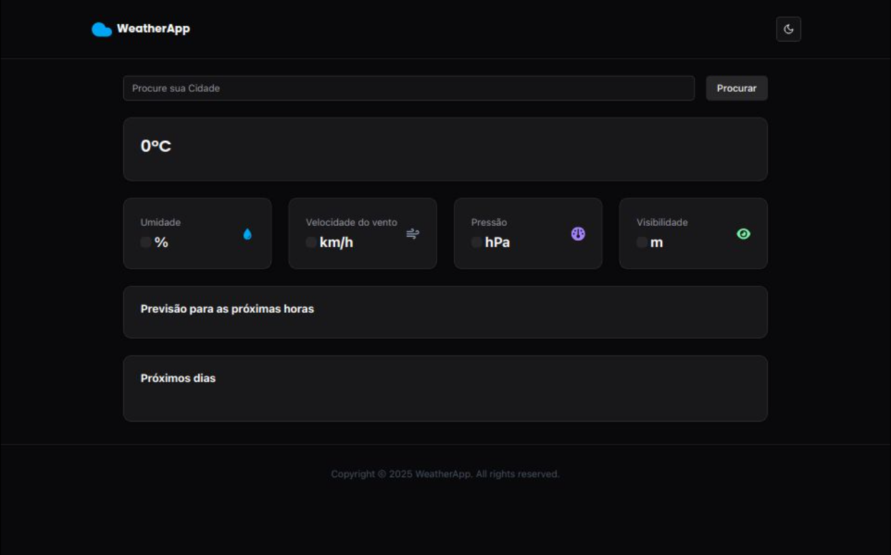

# 🌤 WeatherApp



O **WeatherApp** é um aplicativo de previsão do tempo que exibe informações detalhadas sobre o clima atual e previsões futuras. Você pode verificar a **temperatura**, **umidade**, **velocidade do vento**, **pressão atmosférica** e **visibilidade**. Além disso, ele exibe a previsão do tempo para as **próximas 24 horas** (em intervalos de 3 horas) e para os **próximos 5 dias**.

## 🚀 Tecnologias utilizadas

- ⚛ **React** + **TypeScript**
- 🎨 **TailwindCSS**
- 🌎 **OpenWeather API** (dados climáticos)
- 📍 **GeoNames API** (geolocalização)
- 🌐 **Vercel** (deploy)

## 🔗 Acesse o projeto online

🔗 [WeatherApp no Vercel](https://devmtsweather.vercel.app/)

## 📥 Como rodar localmente

> **Pré-requisitos:** Você precisa ter o **pnpm** instalado.

1. Clone o repositório:
   ```bash
   git clone https://github.com/seu-usuario/weatherapp.git
   cd weatherapp
   ```

2. Instale as dependências:
   ```bash
   pnpm i
   ```

3. Inicie o projeto:
   ```bash
   pnpm run dev
   ```

4. Acesse no navegador: `http://localhost:5173`

## ✨ Funcionalidades

✅ Busca de cidades  
✅ Temperatura atual  
✅ Umidade, Velocidade do vento, Pressão e Visibilidade  
✅ Previsão para as próximas 24 horas (de 3h em 3h)  
✅ Previsão para os próximos 5 dias  
✅ Modo claro/escuro  

## 📸 Captura de tela


## 📜 Licença

Este projeto é de código aberto e pode ser usado livremente.